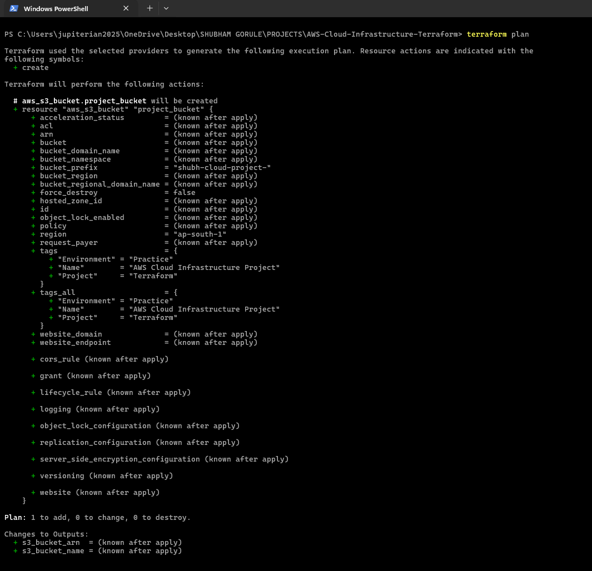
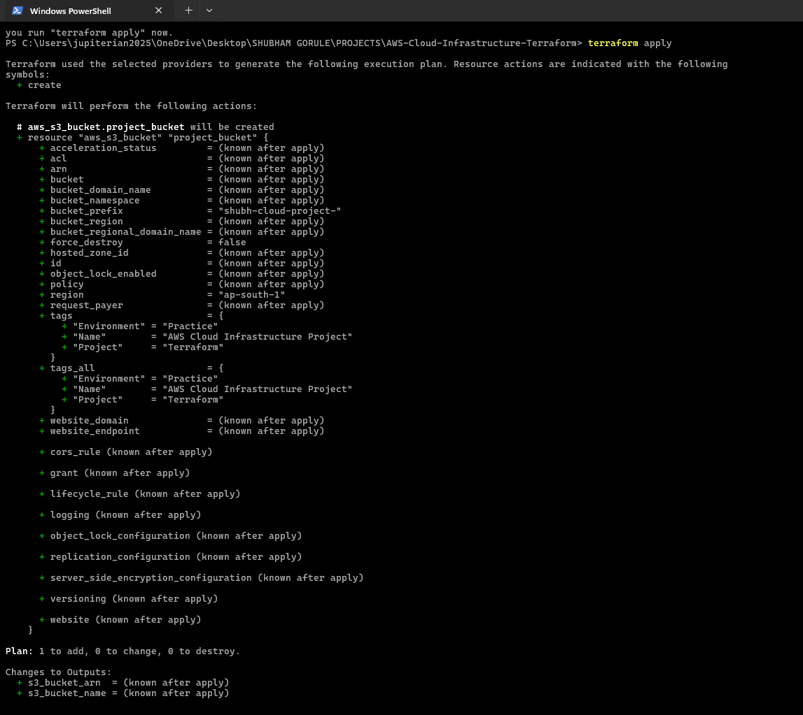

# 🏗️ Terraform-Based AWS Cloud Infrastructure

> 🚀 A beginner-friendly **Infrastructure as Code (IaC)** project that provisions and manages an **Amazon S3 bucket on AWS using Terraform**.


---

## 📌 Project Overview

This project demonstrates how **Terraform** can be used to provision and manage AWS cloud infrastructure through **Infrastructure as Code (IaC)**.

Instead of manually creating an S3 bucket through the AWS Management Console, the infrastructure is defined using Terraform configuration files and deployed through the Terraform CLI.

The project also includes:

* ✅ Terraform configuration
* ✅ AWS provider configuration
* ✅ Amazon S3 bucket provisioning
* ✅ AWS CLI verification
* ✅ Terraform validation
* ✅ Terraform execution planning
* ✅ Infrastructure deployment
* ✅ Terraform outputs
* ✅ Resource tagging
* ✅ Documentation and architecture explanation

---

## 🎯 Project Objectives

The main objectives of this project are to understand:

* 🏗️ Infrastructure as Code concepts
* ⚙️ Terraform configuration and workflow
* ☁️ Terraform's interaction with AWS
* 🪣 Amazon S3 resource provisioning
* 🔐 AWS IAM authentication and authorization
* 🖥️ AWS CLI verification
* 🔄 Terraform deployment lifecycle
* 📦 Infrastructure version control using Git
* 📝 Cloud infrastructure documentation

---

# 🏗️ Architecture

This project uses **Terraform as an Infrastructure as Code (IaC) tool** to provision AWS resources.

The architecture consists of the following components:

### 1. 💻 Developer Environment

The project is developed on a Windows machine using:

* Visual Studio Code
* PowerShell
* Terraform CLI
* AWS CLI
* Git

The developer writes Terraform configuration files that describe the desired AWS infrastructure.

---

### 2. ⚙️ Terraform

Terraform acts as the **Infrastructure as Code layer**.

Terraform:

* 📖 Reads the configuration files
* 🔌 Initializes the required provider
* ✅ Validates the configuration
* 📋 Generates an execution plan
* 🔗 Communicates with AWS APIs
* 🚀 Creates and manages AWS resources

---

### 3. ☁️ AWS Provider

The **Terraform AWS Provider** enables Terraform to communicate with AWS services.

This project uses the AWS provider with the:

**AWS Mumbai Region — `ap-south-1` 🇮🇳**

---

### 4. 🔐 AWS IAM

AWS IAM provides authentication and authorization for AWS API requests.

The configured IAM identity provides Terraform with the permissions required to provision the infrastructure.

> 🔒 **Security Note:** In production environments, IAM permissions should follow the **Principle of Least Privilege** rather than relying on broad administrator permissions.

---

### 5. 🪣 Amazon S3

Terraform provisions an **Amazon S3 bucket** as the primary cloud resource.

The bucket is:

* Created using Terraform
* Managed through Infrastructure as Code
* Configured with project-specific tags
* Verified using AWS CLI

---

## 🔄 Infrastructure Flow

```text
                 👨‍💻 Developer
                      │
                      │ Terraform Configuration
                      ▼
                ⚙️ Terraform CLI
                      │
                      │ AWS Provider
                      ▼
                   ☁️ AWS API
                      │
              ┌───────┴────────┐
              │                │
             🔐 IAM            │
     Authentication &          │
       Authorization            │
              │                ▼
              └────────────── 🪣 Amazon S3
                                  │
                                  ▼
                              S3 Bucket
```

---

# 🔁 Terraform Deployment Lifecycle

The project follows the standard Terraform workflow:

```text
📝 Terraform Configuration
          │
          ▼
    terraform init
          │
          ▼
   terraform validate
          │
          ▼
    terraform plan
          │
          ▼
   terraform apply
          │
          ▼
     ☁️ AWS Resource
          │
          ▼
   terraform output
```

---

# 🛠️ Technologies Used

| Technology    | Purpose                        |
| ------------- | ------------------------------ |
| ☁️ AWS        | Cloud infrastructure           |
| 🪣 Amazon S3  | Object storage                 |
| ⚙️ Terraform  | Infrastructure as Code         |
| 🔐 AWS IAM    | Authentication & authorization |
| 🖥️ AWS CLI   | AWS resource verification      |
| 💻 PowerShell | Command-line environment       |
| 📝 VS Code    | Development environment        |
| 🌱 Git        | Version control                |
| 🐙 GitHub     | Source code hosting            |

---

# 📁 Project Structure

```text
AWS-Cloud-Infrastructure-Terraform/
│
├── 📄 main.tf
├── 📄 provider.tf
├── 📄 variables.tf
├── 📄 outputs.tf
├── 📄 README.md
├── 📄 .gitignore
│
└── 📁 screenshots/
    ├── terraform-init.png
    ├── terraform-plan.png
    ├── terraform-apply.png
    ├── s3-bucket.png
    └── aws-cli-verification.png
```

> 📌 The exact files and screenshot names may vary depending on the final repository structure.

---

# ⚙️ Prerequisites

Before running the project, install and configure:

### 1. Terraform

Verify the installation:

```bash
terraform version
```

### 2. AWS CLI

Verify:

```bash
aws --version
```

### 3. AWS Credentials

Configure an AWS identity with the required permissions.

Verify the active identity:

```bash
aws sts get-caller-identity
```

### 4. Git

Verify:

```bash
git --version
```

---

# 🚀 Deployment

## Step 1 — Clone the Repository

```bash
git clone <YOUR-GITHUB-REPOSITORY-URL>
cd AWS-Cloud-Infrastructure-Terraform
```

---

## Step 2 — Initialize Terraform

```bash
terraform init
```

This downloads and initializes the required Terraform provider.

---

## Step 3 — Format the Configuration

```bash
terraform fmt
```

This formats Terraform configuration files according to Terraform's standard formatting rules.

---

## Step 4 — Validate the Configuration

```bash
terraform validate
```

Expected result:

```text
Success! The configuration is valid.
```

---

## Step 5 — Review the Execution Plan

```bash
terraform plan
```

Terraform displays the infrastructure changes that will be made without actually creating the resources.

---

## Step 6 — Deploy the Infrastructure

```bash
terraform apply
```

Review the proposed changes and confirm the deployment when prompted.

Terraform will then provision the S3 bucket in AWS.

---

## Step 7 — View Terraform Outputs

```bash
terraform output
```

This displays the output values defined in `outputs.tf`.

---

# 🔍 AWS CLI Verification

The deployed S3 resources can also be verified using the AWS CLI.

For example:

```bash
aws s3 ls
```

You can also verify the AWS account and active identity:

```bash
aws sts get-caller-identity
```

This provides an additional way to confirm that Terraform successfully interacted with the intended AWS account.

---

# 🧹 Destroy Infrastructure

When the infrastructure is no longer required, Terraform can remove the resources it created:

```bash
terraform destroy
```

Review the proposed deletion and confirm when prompted.

> ⚠️ **Important:** `terraform destroy` permanently removes resources managed by the Terraform configuration. Always verify the resources before confirming.

---

# 🔐 Security Considerations

Security is an important part of cloud infrastructure management.

This project follows several basic security practices:

* 🔒 AWS credentials should never be committed to GitHub.
* 🚫 Sensitive files such as `.tfvars` containing secrets should be excluded using `.gitignore`.
* 🔑 IAM permissions should follow the **Principle of Least Privilege**.
* 🛡️ Production infrastructure should use dedicated IAM roles and controlled permissions.
* 🔐 Secrets should be managed using appropriate secret-management solutions rather than hardcoded into Terraform files.

### ❌ Never commit credentials like:

```text
AWS Access Key
AWS Secret Access Key
Passwords
Private Keys
Terraform variable files containing secrets
```

---

# 📸 Screenshots

Screenshots demonstrating the project execution can be added here.

### Terraform Initialization


### Terraform Plan



### Terraform Apply



### Amazon S3 Bucket


### AWS CLI Verification


---

# 🧠 What I Learned

Through this project, I practiced:

* 🏗️ Infrastructure as Code
* ⚙️ Terraform fundamentals
* ☁️ AWS resource provisioning
* 🪣 Amazon S3
* 🔐 AWS IAM concepts
* 🖥️ AWS CLI
* 🔄 Terraform lifecycle
* 📋 `terraform plan`
* 🚀 `terraform apply`
* 🧹 `terraform destroy`
* 🌱 Git and GitHub workflow
* 📝 Infrastructure documentation

---

# 💡 Key Takeaway

This project demonstrates how **Infrastructure as Code can replace manual cloud resource provisioning**.

Instead of manually creating infrastructure through the AWS Console, Terraform allows infrastructure to be:

```text
📝 Defined as Code
       ↓
🔍 Reviewed
       ↓
📋 Planned
       ↓
🚀 Deployed
       ↓
🔄 Managed
       ↓
🧹 Destroyed
```

This approach makes cloud infrastructure easier to **reproduce, version-control, review, and manage consistently**.

---

# 🎓 Project Type

**Cloud Computing / Infrastructure as Code / AWS / Terraform**

### Difficulty

🟢 Beginner → Intermediate

### Primary AWS Service

🪣 Amazon S3

### IaC Tool

⚙️ Terraform

### AWS Region

🇮🇳 Mumbai — `ap-south-1`

---

# 👨‍💻 Author

**Shubham Gorule**

🎓 BCA Student
☁️ Aspiring Cloud Engineer
🔧 AWS • Linux • Networking • Terraform • Docker • Kubernetes • DevOps

🔗 GitHub: **jupiterian23**

---

## ⭐ If You Found This Project Useful

Feel free to explore the repository, review the Terraform configuration, and experiment with your own AWS infrastructure.

**Built with ☁️ AWS + ⚙️ Terraform + 💻 Curiosity**
